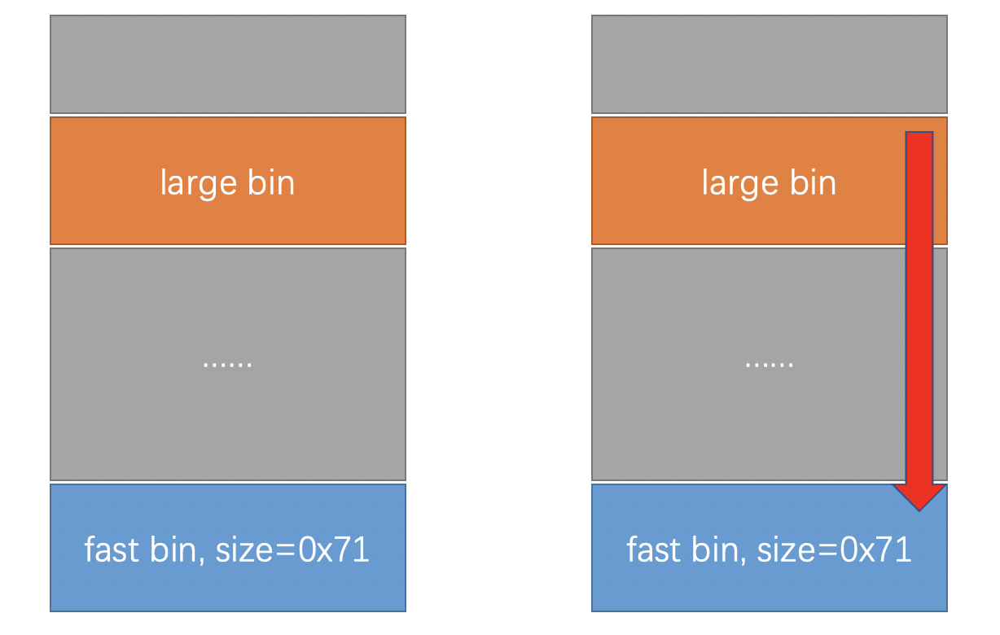

# Anheng201810_heaplevel1

### 题目信息：

```c
libc-2.23.so
Arch:     amd64-64-little
RELRO:    Full RELRO
Stack:    Canary found
NX:       NX enabled
PIE:      PIE enabled
```

### 题目概述：

题目逻辑比较简单，无限循环执行play函数，其中有两个功能：分配堆块、打印堆块。分配堆块限制大小最大为`0x1000`，随后使用`gets`进行写入，存在无限长度的溢出。打印堆块中使用`printf(buffer)`，格式化字符串漏洞，不了解格式化字符串的同学参考这里[ctf-wiki](https://ctf-wiki.github.io/ctf-wiki/pwn/linux/fmtstr/fmtstr_intro-zh/)。需要注意的是，程序中没有`free`逻辑，不能按照常规堆溢出的手法去构造`overlap`，另外`gets`函数在读入后会在末尾置零，无法通过堆上`unsoted bin`泄漏`libc`。

### 利用思路：

在保护全开的程序中，思考一下常规利用手法：

- 【1】泄漏出`libc`地址。
- 【2】通过溢出进行`fastbin attack`，修改`fastbin`链至`&__malloc_hook-0x23`，修改`malloc_hook`为`one_gadget`。

在该程序中，【1】可以使用格式化字符串漏洞方便的实现，但由于没有`free`逻辑，这让【2】手段难以执行。当遇到困惑时，阅读对应版本的`lib`源码，打开新世界，查看glibc-2.23源码，`_int_malloc`函数存在以下逻辑：

```c
use_top:
  /*
  If large enough, split off the chunk bordering the end of memory
  (held in av->top). Note that this is in accord with the best-fit
  search rule.  In effect, av->top is treated as larger (and thus
  less well fitting) than any other available chunk since it can
  be extended to be as large as necessary (up to system
  limitations).

  We require that av->top always exists (i.e., has size >=
  MINSIZE) after initialization, so if it would otherwise be
  exhausted by current request, it is replenished. (The main
  reason for ensuring it exists is that we may need MINSIZE space
  to put in fenceposts in sysmalloc.)
  */
	....
    ....
    /*
         Otherwise, relay to handle system-dependent cases
       */
    else
    {
      void *p = sysmalloc (nb, av);
      if (p != NULL)
        alloc_perturb (p, bytes);
      return p;
    }
```

当申请堆块大小大于top_chunk的size时，执行`sysmalloc`逻辑，在sysmalloc函数中，存在以下逻辑：

```CQL
if (old_size >= MINSIZE)
{
  set_head (chunk_at_offset (old_top, old_size), (2 * SIZE_SZ) | PREV_INUSE);
  set_foot (chunk_at_offset (old_top, old_size), (2 * SIZE_SZ));
  set_head (old_top, old_size | PREV_INUSE | NON_MAIN_ARENA);
  _int_free (av, old_top, 1);
}
```

这就是大名鼎鼎的`house of orange`，通过修改`top_chunk`的`size`，在没有`free`的程序中，当`malloc`时实现`free`的效果。

```
# 摘录自ctf-wiki
总结一下伪造的 top chunk size 的要求

伪造的 size 必须要对齐到内存页
size 要大于 MINSIZE(0x10)
size 要小于之后申请的 chunk size + MINSIZE(0x10)
size 的 prev inuse 位必须为 1
之后原有的 top chunk 就会执行_int_free从而顺利进入 unsorted bin 中。
```

有了以上基础知识，我们可以想办法构造出以下这样的堆块布局。



这里是[exploit.py](./exp.py)，如果要直接使用，请确保`one_gadget`偏移是否符合你的环境。

### 支持与联系

我是一名普普通通的`Bachelor`学生，为了强化理解学习的知识，所以开始了我漫长的自学道路，你在这个网页看到的所有内容，都是我在网上探索，自学而来的。如果觉得本文档对你的学习有帮助，也谢谢`star`本仓库。联系到我有很多种方式，欢迎大家用各种途径留言，有时间的话，我会尽量回复你的留言或问题。以下是几种可以讨论的方式:

- Emalil: wang.qi.ao@qq.com
- Github: https://github.com/wangtsiao