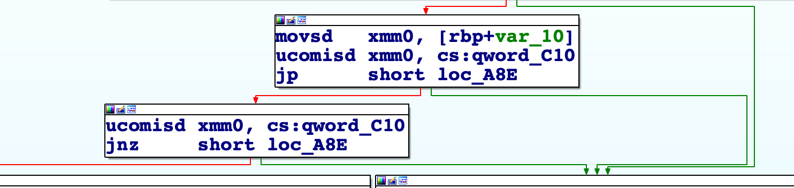

# HWB2018_pwnstack

护网杯pwn的签到题目，简单的栈溢出，不同与以往的是，这里用了浮点数比较。

```c
printf("HuWangBei CTF 2018 will be getting start after %lu seconds...\n", 0LL, 1.797693134862316e308);
puts("But Whether it starts depends on you.");
read(0, &buf, 0x28uLL);
if ( v7 != 0x7FFFFFFFFFFFFFFFLL || v8 != 0.1 )
{
  puts("Try again!");
}
else
{
  printf("HuWangBei CTF 2018 will be getting start after %g seconds...\n", &buf, v8);
  system("/bin/sh");
}
```

x86汇编语言层面在对浮点数进行比较时，使用了一下一段代码。`ucomisd` - 无序比较标量双精度浮点值并设置 EFLAGS。此外，PF奇偶标志位：反映运算结果低8位中“bai1”的个数。“1”的个数为偶数，du则PF置1，否则置0，如果`PF`为1则`jp`跳转指令可以跳转到目标位置 `jnp`相反。



这里是[exploit.py](./exp.py)。

### 支持与联系

我是一名普普通通的`Bachelor`学生，为了强化理解学习的知识，所以开始了我漫长的自学道路，你在这个网页看到的所有内容，都是我在网上探索，自学而来的。如果觉得本文档对你的学习有帮助，也谢谢`star`本仓库。联系到我有很多种方式，欢迎大家用各种途径留言，有时间的话，我会尽量回复你的留言或问题。以下是几种可以讨论的方式:

- Emalil: wang.qi.ao@qq.com
- Github: https://github.com/wangtsiao