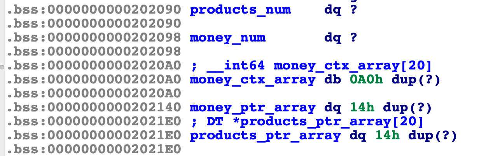

# HWB2018_shoppingcart

### 题目信息：

```c
glibc-2.23.so
Arch:     amd64-64-little
RELRO:    Partial RELRO
Stack:    Canary found
NX:       NX enabled
PIE:      PIE enabled
```

### 题目概述：

相对来说比较典型的一个堆块维护程序，第一个函数，理解为准备钱的功能，可以分配最多`20`个固定大小为`0x10`的堆块，堆块内指针指向`.bss`段数组，每项固定长度为`8`。第二个函数，实现添加、删除、编辑以及使用`printf`打印堆块内容的功能，同样最多分配20个固定大小0x10的堆块，不同的是堆块内指针指向另一堆块，是可以自由控制大小的堆块。指针指向内存中包含指针，我把这种的结构称为二级指针，结构如下图所示：


这道题目的漏洞相对比较隐秘，都是在编辑函数中。

- 直接把read的返回值作为偏移，将最后字符置零，是一种典型的`null by one`。
- 对输入的下标没有进行边界判断，可以越界向上访问，也可以越界向下访问，在题目中主要用到的是向下访问。

漏洞代码：

```c
v4 = __readfsqword(0x28u);
puts("Which goods you need to modify?");
fgets(&s, 24, stdin);
v0 = strtoul(&s, 0LL, 0);
printf("OK, what would you like to modify %s to?\n", products_ptr_array[v0]->name_ptr, v0);
products_ptr_array[v1]->name_ptr[read(0, products_ptr_array[v1]->name_ptr, 8uLL)] = 0;
return __readfsqword(0x28u) ^ v4;
```

认清战局，才能更好的定制兵法，在考虑如何利用之前，首先观察.bss段上全局变量的分布情况，用于商品堆块计数的`products_num`变量和用于金钱堆块计数的变量`money_num`位于低地址，随后是金钱堆块内指针指向的`.bss`数组，其中每项大小长度为`8`，接下来是指向金钱堆块的指针数组，最后是指向商品堆块的指针数组（`products_ptr_array`）。注：以上符号均为根据逻辑分析以后，我标记的名称。



### 利用思路：

通过对`products_ptr_array`指针数组的向下越界访问，可以访问到`money_ptr_array`，通过程序提供的编辑功能，可以吧`money_ctx_array`中数据修改为任何值，接下来再次通过越界访问，访问到`money_ctx_array`，可以实现任意地址读写能力。程序开启了pie保护，在这之前需要思考如何泄漏程序的基地址。

- 程序退出前，`__cxa_finalize`函数会引用一个指向程序自身的指针，位于`0x202068`处。

通过越界访问`0x202068`处的变量，泄漏程序的基地址，通过堆上`unsorted bin`泄漏`libc`基地址，程序没有开启`GOT`表保护，覆写`strtoul@got`为`system@sym`。

这里是以上思路的[exploit1.py](./exp_use_got.py)。

接下来还有一种利用思路，该程序使用fgets进行读入，在第一次调用 `fgets` 时，会为 `fp` 参数的 `_IO_buf_base` 分配一块内存用于暂存用户发过来的数据，这块缓冲区是在堆区的顶部。结合`null by one`漏洞，往 `money_ctx_array[19]` 的 第 `9` 个字节写 `\x00` ，通过改 `currency_type` 的最后一项可以让 `products_ptr_array` 第一项的第一个字节为 `\x00`，当 `products_ptr_array[0]` 的指针的最低字节被置 `\x00` 后，会落入 `stdin` 的 `_IO_buf_base` 里面， 通过往程序发送有效地址数据，实现任意地址读写，这里修改`__free_hook`为`system`。

这里是以上思路的[exploit2.py](./exp_use_fgets.py)

