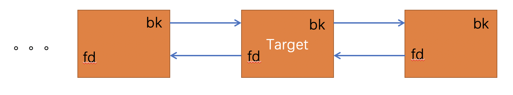
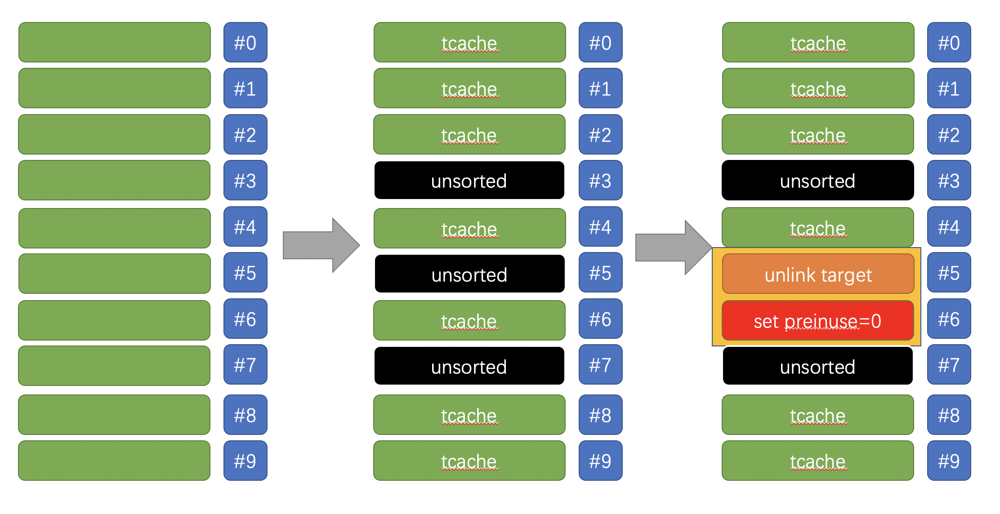

# LCTF2018_easyheap

### 题目信息：

>```c
>libc-2.27.so
>Arch:     amd64-64-little
>RELRO:    Full RELRO
>Stack:    Canary found
>NX:       NX enabled
>PIE:      PIE enabled
>```

### 题目概述：

程序实现了堆块的添加、删除、打印功能，其中堆块大小固定，为0xf8。在添加堆块的逻辑中，读入内容函数存在`null by one`漏洞，有两处置零，第一次按照读入字符串长度置零，第二次按照传入的长度参数将溢出的第一个字节置零。

```c
unsigned __int64 __fastcall read_ctx_nullbyone(_BYTE *a1, int a2)
{
  unsigned int v3; // [rsp+14h] [rbp-Ch]
  unsigned __int64 v4; // [rsp+18h] [rbp-8h]

  v4 = __readfsqword(0x28u);
  v3 = 0;
  if ( a2 )
  {
    while ( 1 )
    {
      read(0, &a1[v3], 1uLL);
      if ( a2 - 1 < v3 || !a1[v3] || a1[v3] == 10 )
        break; // 不可读入‘\0’字符。
      ++v3;
    }
    a1[v3] = 0;//按照读入长度置零
    a1[a2] = 0;//按照size置零
  }
  else
  {
    *a1 = 0;
  }
  return __readfsqword(0x28u) ^ v4;
}
```

### 利用思路：

堆块大小固定为`0xf8`，于是堆块的`size`位都是`0x101`，溢出一个字节置零，这相当于设置`preinuse`位为空。利用链很明显需要构造`chunk overlap`，`tcache`中没有向前合并的操作，当填满`tcache`之后，堆块进入`unsorted bin`，利用`unsorted bin`在`free`时向前合并的操作，构造`overlap`，正如下面`glibc2.27`的源码逻辑所示。

```c
/* consolidate backward */
if (!prev_inuse(p)) {
  prevsize = prev_size (p);
  size += prevsize;
  p = chunk_at_offset(p, -((long) prevsize));
  unlink(av, p, bck, fwd);
}

#define unlink(AV, P, BK, FD) {                                            \
    if (__builtin_expect (chunksize(P) != prev_size (next_chunk(P)), 0))      \
      malloc_printerr ("corrupted size vs. prev_size");			      \
    FD = P->fd;								      \
    BK = P->bk;								      \
    if (__builtin_expect (FD->bk != P || BK->fd != P, 0))		      \
      malloc_printerr ("corrupted double-linked list");			      \
    else {								      \
        FD->bk = BK;							      \
        BK->fd = FD;
		.......
    ........
		}
}
```

需要注意的是，在`unlink`的过程中，需要`FD->bk == P || BK->fd == P`，由于程序限制不能输入零字符，便没有办法直接伪造`fd`与`bk`指针，比较幸运的一点，当从`unsorted bin`中`malloc`获得堆块时，`glibc`会将`unsortedbin`中剩下的符合大小的堆块放到`tcache`中，逻辑如下代码所示-来自`glibc2.27`源码。

```c
#if USE_TCACHE
	  /* While we're here, if we see other chunks of the same size,
	     stash them in the tcache.  */
	  size_t tc_idx = csize2tidx (nb);
	  if (tcache && tc_idx < mp_.tcache_bins)
	    {
	      mchunkptr tc_victim;

	      /* While bin not empty and tcache not full, copy chunks over.  */
	      while (tcache->counts[tc_idx] < mp_.tcache_count
		     && (tc_victim = last (bin)) != bin)
		{
		  if (tc_victim != 0)
		    {
		      bck = tc_victim->bk;
		      set_inuse_bit_at_offset (tc_victim, nb);
		      if (av != &main_arena)
			set_non_main_arena (tc_victim);
		      bin->bk = bck;
		      bck->fd = bin;

		      tcache_put (tc_victim, tc_idx);
	            }
		}
	    }
#endif
```

当`unsorted bin`中至少有三个堆块时，中间`Target`堆块可以满足`FD->bk == P || BK->fd == P`，当`overlap`构造成功后接下来便是修改`tcache`指针，修改`__free_hook`为`one_gadget`。



### exp原理



这里是[exploit.py](./exp.py)，如果要直接使用，你可能需要修改一下`one_gadget`偏移。

