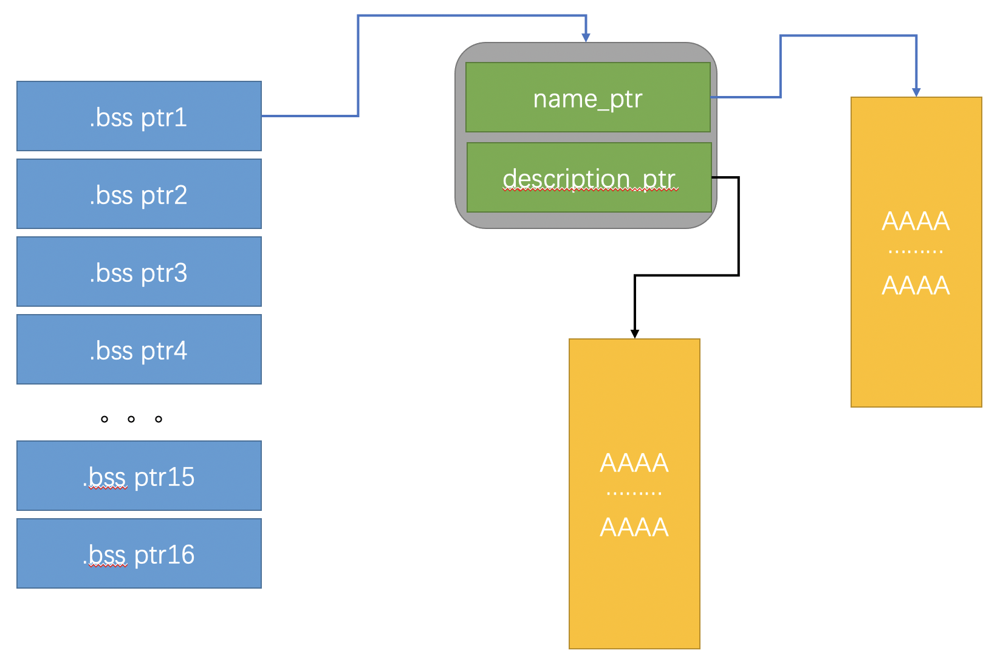

# NULLCON2019_tudutudututu

### 题目信息：

```c
libc-2.23.so
Arch:     amd64-64-little
RELRO:    Full RELRO
Stack:    Canary found
NX:       NX enabled
PIE:      NO PIE
```

### 题目概述：

中规中矩的一个堆块管理程序，实现了一个二层指针的堆块管理。再继续进行之前，介绍一下程序中使用的主要数据结构。在`.bss`段有一指针数组，其中每项都指向堆块，每个堆块的长度为`0x10`，前`8`字节用于存储指向`名称`字符串的指针，该指针由`strdup`返回，后8字节用于存储指向`描述`字符串的指针。



在删除函数中，程序判断`description`指针不为空的话，便调用`free`，堆块内`descripton`指针没有置空，接下来的逻辑没有问题，用最后一个堆块指针替代被删除掉的那个指针。问题在于，添加`名称`堆块的逻辑中，没有对`description_ptr`指针置空，上述两点结合，可以达到一个`use after free`的效果。

加深理解，`poc`：

添加`名称`字符串：`“1”`，设置其`描述`字符串，长度`0x17`。

添加`名称`字符串：`“2”`，防止删除`“1”`时堆块与`top_chunk`合并。

删除`名称`字符串：`“1”`，此时删除了对应的`描述`字符串，落入`0x20`大小的fastbin中。

添加`名称`字符串：`“1”`，又将刚才的堆块分配过来，但是`描述`字符串指针没有变化。

删除`名称`字符串：`“1”`，再次删除了`描述`字符串指针，触发`double free`报错。

### 利用思路：

通过`unsorted bin`泄漏`libc`，接下来利用`fastbin double free`修改`fastbin`链表指向`__malloc_hook`，`exp`中`__malloc_hook-0x23`是为了凑出`0x7f`堆块`size`位，绕过`fastbin`安全检测。通过四个`one_gadget`尝试`getshell`均不成功，可以通过触发`double free`报错来执行`__malloc_hook`。

这里是[exploit.py](./exp.py)，如果要直接使用，你可能需要修改下`one_gadget`偏移。

### 支持与联系

我是一名普普通通的`Bachelor`学生，为了强化理解学习的知识，所以开始了我漫长的自学道路，你在这个网页看到的所有内容，都是我在网上探索，自学而来的。如果觉得本文档对你的学习有帮助，也谢谢`star`本仓库。联系到我有很多种方式，欢迎大家用各种途径留言，有时间的话，我会尽量回复你的留言或问题。以下是几种可以讨论的方式:

- Emalil: wang.qi.ao@qq.com
- Github: https://github.com/wangtsiao