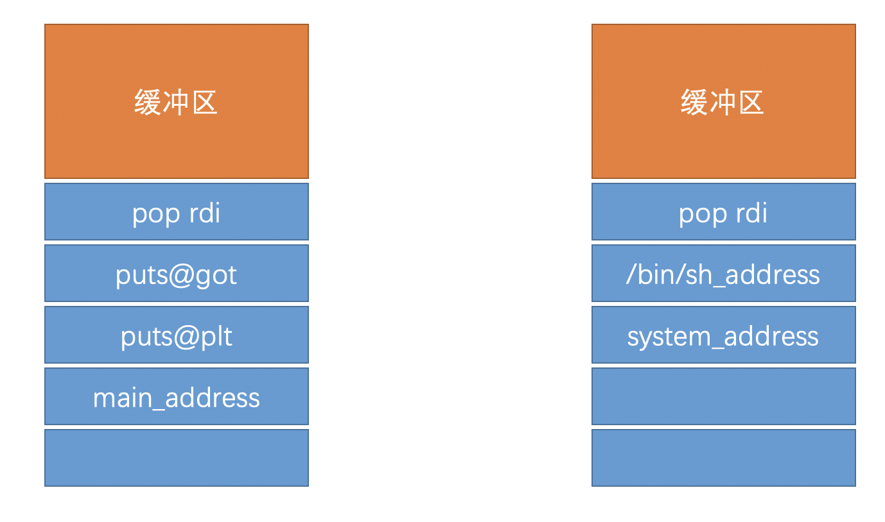

# XMAS2018_randompresent

### 题目信息：

```c
Arch:     amd64-64-little
RELRO:    Partial RELRO
Stack:    No canary found
NX:       NX enabled
PIE:      No PIE (0x400000)
```

### 题目概述：

和[Anheng201810_whoami](./Anheng201810_whoami)相比较，该题目同样是栈上的溢出，不过程序中不再有可以直接执行的`system`，需要进行`rop`去泄漏`libc`基地址，随后执行`system`。中规中矩的栈溢出问题，在利用之前，查看程序中可以被使用的`plt`表和`got`表，含有`puts`，可以使用`puts@plt`去打印`puts@got`，接着使程序继续返回`main`，再次进行`rop getshell`，两次布置栈如下。



从上面看出来，`pop rdi`发挥着比较重要的作用，在`64`位下，函数第一个参数由`rdi`所传递，将参数放到栈上，再通过执行`pop rdi`，将参数传给`rdi`，接着`retn`到函数处执行。需要注意的是，传递的字符串`/bin/sh`参数为指针，当得到`libc`基地址后，可以通过`next(libc.search("/bin/sh"))`得到。

这里是[exploit.py](./exp.py)

