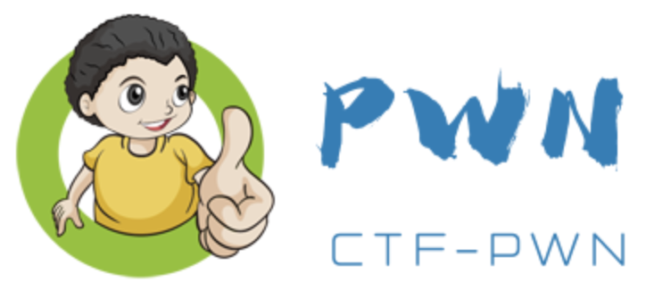

### 图解CTF-PWN

**CTF**（Capture The Flag，夺旗赛）起源于 1996 年 **DEFCON** 全球黑客大会，是网络安全爱好者之间的竞技游戏。**PWN**作为**CTF**中的主要内容之一，在每场比赛中发挥着至关重要的作用。

丰富的题目内容，每一道都是认真斟酌，经得起敲打，包含通俗易懂的题解，以及完善的利用脚本，是学习`CTF-PWN`路上的不二之选。

### 支持与联系

- Emalil: wang.qi.ao@qq.com

